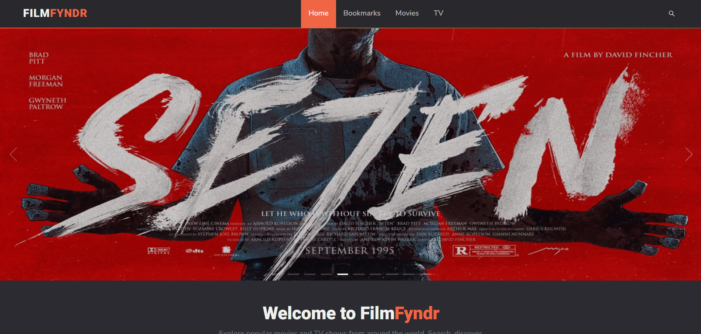
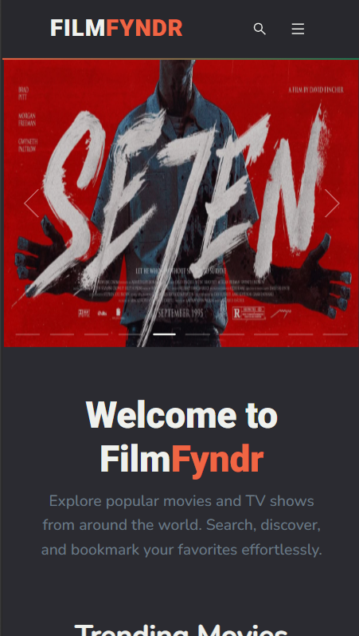
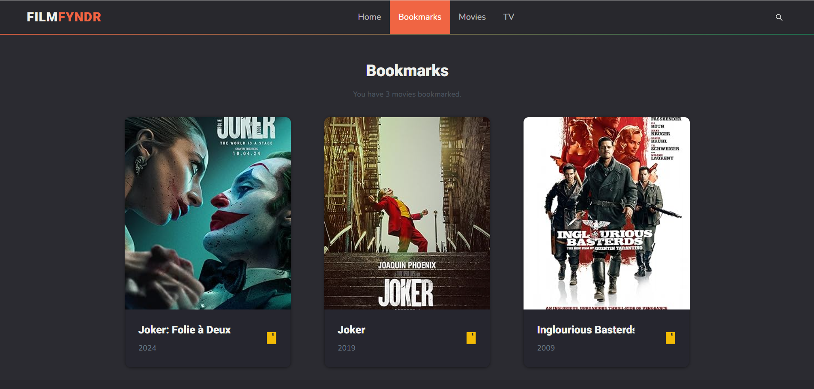
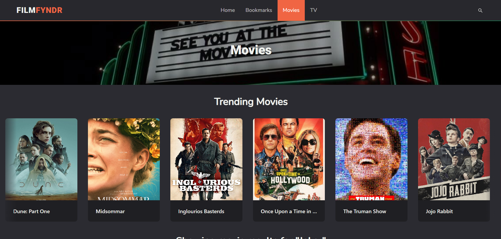
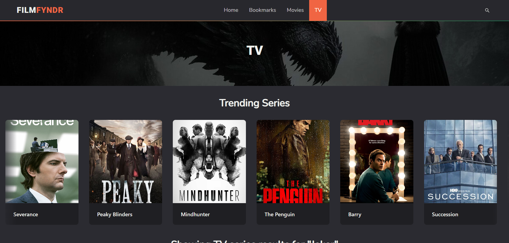
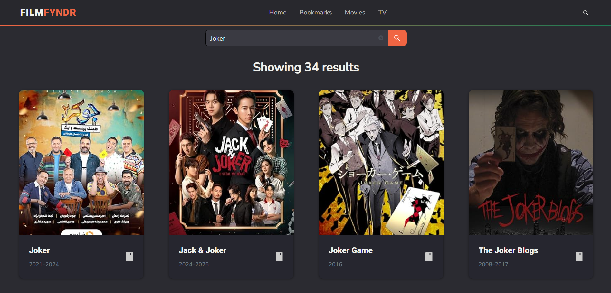

# FilmFyndr

FilmFyndr is a web application designed to empower users to effortlessly browse vast collections of movies and series and curate their own personalized lists by bookmarking favorites.

## Features

 - Debounced Search
 - Responsive UI
 - Bookmarking

## Technologies

 - Next
 - Ant Design
 - React Query
 - Redux Toolkit

## Getting Started

### Prerequisites

 - Node.js (version 14 or newer)
 - npm

### Installation

 1. Clone this repository: `git clone https://github.com/adarshkumar-nt/film-fynder.git`
 2. Navigate to moodspace: `cd film-fynder`
 3. Install Dependencies: `npm install`

### Development Mode

 1. Start the Next develpment server: `npm run dev`

### Production Build

 1. Create an optimized build: `npm run build`
 2.  The  `dist`  folder produced by the build process contains static files. Deploy these to your preferred web hosting platform.

## Screenshots

### Home Page
 
### Home Page(mobile)

### Bookmarks Page

### Movies Page

### TV Page

### Search Page

